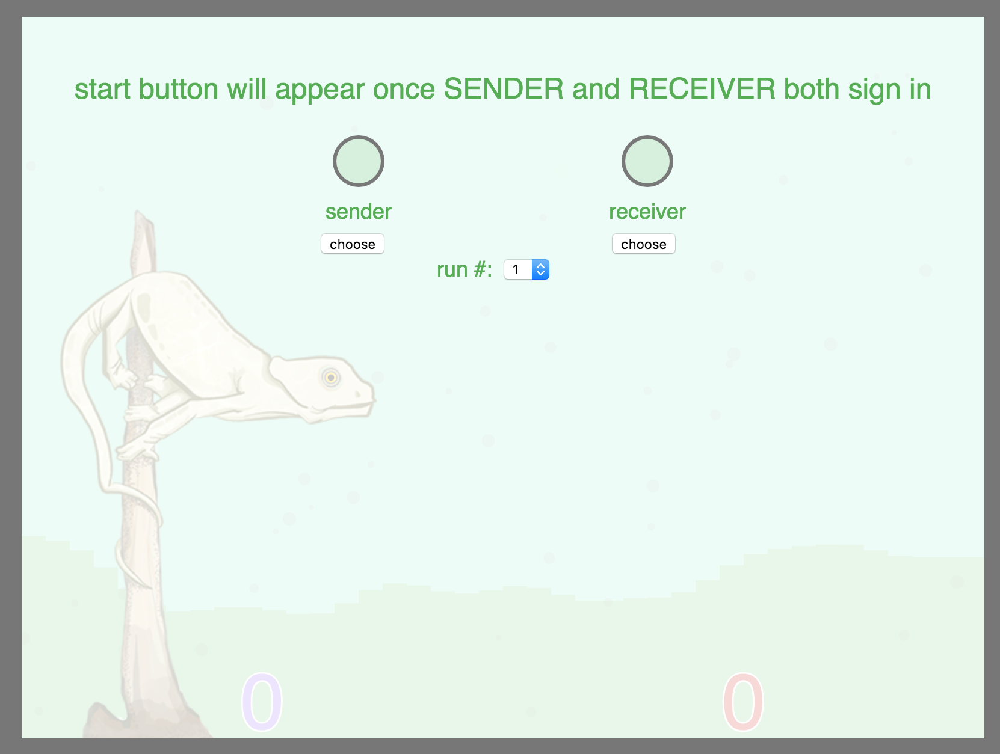

# Guthrie TMS steps

## Set up Wifi

* Plug in USB wi-fi device

* In lower left corner, click on internet connectivity, and connect to `University of Washington` Wireless Network

* Open up a command prompt and type: `ipconfig`

* Write down the `IPv4 Address` under the `Wireless LAN adapter Wireless Network Connection` (**NOTE: MAKE SURE IT'S THE WIRELESS NETWORK ADDRESS**). You will have to provide this address to the folks at the scanner so they can configure **Pyneal** to send messages to this computer

## Set up TMS server

* open a file browser and navigate to: `C:\Users\Experimenter\b2b\TMS_server`

* open up `TMS_server.py` in `Notepad++` (or similar editor), and confirm that the `socketPort` is set to `6666` (somewhere around line 23), and that the `serialPort` is set to `COM19`.

* open the **Command Prompt** and type: `cd C:\Users\Experimenter\b2b\TMS_server`

* When you are ready to begin, launch the server by typing: `C:\Python27\python.exe TMS_server.py`

## Magstim

### turning on

* Confirm that the gray communication port cable is plugged into the COM port on the back of the magstim (the display head on top of the device may be plugged into that port...if so, unplug and replace with the gray cable). 

* On back of magstim device, flip black power switch to on.

* Then, on the front of the device, hit the blue power button

* If no subject, place the coil in the chair mount, or on the chair, so its not directly against the magstim device. 

### adjusting intensity

## Task setup

* open a browser window and navigate to: [http://ec2-54-236-226-138.compute-1.amazonaws.com:8080/task.html](http://ec2-54-236-226-138.compute-1.amazonaws.com:8080/task.html)

	* *Note*: this address may change as the AWS instances are stopped/restarted. Confirm with Jeff that the address is correct

* At the start screen, choose `Receiver`: 
(don't worry about the run number)

* **Make sure browser window with the game remains the active window and receives cursor input. You may want to view the console browser as well during this, but make sure you always click back to the game as well**

* That's it! Sit back and watch

* At the end of the task, when it brings you back to the start screen, hit refresh, and re-choose `Receiver`